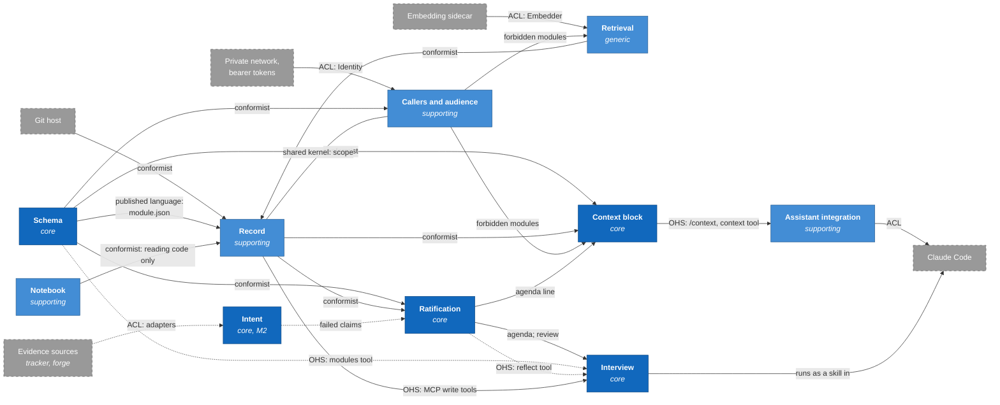

# Bounded contexts

Brabeus is one kernel, one plugin and a set of modules, but its model is not one model. A
*record* means a file with frontmatter to the store, a scored document to retrieval, and a
question waiting for an answer to ratification. Each context below is a boundary inside which
the terms in [`ubiquitous-language.md`](ubiquitous-language.md) have one meaning. A context is a
boundary of language and consistency, not a package: several span more than one package, and
each section below says where its code lives.

Each section names what the context owns, where it lives, and how it relates to the others. The
relationships use domain-driven design's standard names. An upstream context's model is the one
a downstream context depends on; a *conformist* adopts the upstream model as it is; an
*anti-corruption layer* (ACL) translates an outside model at the boundary so it does not leak in;
an *open host service* (OHS) is an interface published for any caller; a *published language* is
the documented format that service speaks; and a *shared kernel* is code two contexts own
together.

## Subdomains

| class      | contexts                                                      | why                                                                                                                                                                                                                                                              |
| ---------- | ------------------------------------------------------------- | ---------------------------------------------------------------------------------------------------------------------------------------------------------------------------------------------------------------------------------------------------------------- |
| core       | Ratification, Schema, Context block, Intent, Interview        | what spec §2.4 names as distinctive: authorship enforced by the server, modes a manifest cannot edit, the 2 KB cap as a constraint, claims verified against evidence; and the conversation that writes the record, without which there is nothing to ratify (§9) |
| supporting | Record, Callers and audience, Assistant integration, Notebook | built for Brabeus because nothing off the shelf fits, but not what makes Brabeus distinctive                                                                                                                                                                     |
| generic    | Retrieval, Deployment                                         | ranking by BM25 and embeddings, and wiring a container, are well-solved problems that Brabeus could take from elsewhere                                                                                                                                          |

## The contexts

### Record

Record owns records as files: composing frontmatter from content and stamps, the index, scope
validation, credential refusal, the one-writer path of pull, write, commit and push, and the
migration.

It lives in `internal/store` (`store.go`, `record.go`, `commit.go`, `migrate.go`, `credential.go`,
`path.go`, `index.go`) and `internal/scope`.

The review operation is a method on the store (`Store.Review`) rather than part of Ratification's
code, and that is where it belongs: a verdict rewrites a record's stamps, and every change to a
record must happen under the store's single-writer lock, after a pull and before a push, so that
the kernel stays the only writer (spec §11). Ratification decides
what to ask and what an answer means; Record applies the answer atomically.

Relationships:

- **Git host** (external, upstream). Record conforms: git is the ledger, a commit's author is the
  calling machine, and a review's question and verdict are its commit message.
- **Schema** (upstream). Record conforms: every write is validated against the governing kind
  and the module's layout.
- **Retrieval** (upstream). Record conforms, including for the frontmatter format itself; see
  *Where the code and the contexts disagree*.
- **Callers and audience**. `internal/scope` is a shared kernel between the two: Record validates
  scopes with it, caller resolution normalises host names with it, and the server filters reads
  with it. It holds value-level functions only, which is what keeps sharing it cheap: neither
  context can reach the other's state through it.

### Schema

Schema owns modes, modules, kinds, fields, budgets, the core-module list, the crossing kind and
the governing-module rule.

It lives in `internal/module` and the `modules/` directory.

Relationships:

- **Every other kernel context** (downstream). Each conforms to Schema's model directly, through
  `module.Set`.
- **Module authors**. `module.json` is a published language: a closed set of keys, and the kernel
  refuses a manifest with any key it does not know (spec §6).
- **Interview** (downstream, M2). The read-only `modules` tool is an open host service for the
  module set. Its `lenses`, `draft` and `intro` keys are validated by the kernel and read only by
  the Interview; how to ask belongs to the module (§6).

A mode's rules are published as a `Bundle`, but the downstream contexts do not read it. Each one
compares a module's mode against a constant and applies the rule itself. See *Where the code and
the contexts disagree*.

### Ratification

Ratification owns what is due and what counts as reviewed: the agenda and its ordering, freshness
and due dates, drafts, reasons, verdict semantics, the revision line and snoozes. It also owns the
reflection's facts, which the read-only `reflect` tool computes on demand like the agenda, because
counts and dates are facts the kernel can get right and a model's summary can get wrong. It does
not own the conversation that asks: spec §9 puts that outside the kernel, in the Interview.

It lives in `internal/agenda`, which computes the agenda, and `internal/store/review.go`, which
applies verdicts.

The agenda is a read model: it is computed from the store and the module set on every request and
never stored, so there is no second copy of the record's state to fall out of date. Within each
reason, preferences sort last, native and crossing alike: the person changes a preference about
the assistant when it bothers them, so re-confirming one matters less than the rest of the record.
That ordering is also what lets a preference the assistant wrote be due at once, as a draft,
without crowding the person's own record.

Relationships:

- **Record** (upstream). Conforms: the agenda reads `store.Stored` records as they are.
- **Schema** (upstream). Conforms: freshness, prompts, onboarding and the governing module all
  come from the module set.
- **Context block** (downstream). The top agenda item becomes the agenda line.
- **Interview** (downstream). Reads the agenda, each item with its reason and question, and the
  facts `reflect` returns; returns answers through `review`.
- **Intent** (upstream, M2). Failed claims will head the agenda.

### Retrieval

Retrieval owns ranking: lexical (BM25), dense (embeddings), their fusion, snippets, and the duplicate check.

It lives in `internal/retrieval`, and in `Store.Search` and `Store.SimilarTo`, which apply scope
and audience before ranking so that a record a caller may not see is never scored for it.

Relationships:

- **Embedding sidecar** (external, upstream). It sits behind an anti-corruption layer: the
  `Embedder` interface, with a caching decorator, is the only code that knows a model is being
  called, so the model can be replaced without touching the ranking.
- **Record** (downstream). The store builds and owns the index; retrieval supplies the ranking.

### Callers and audience

Callers and audience owns who is calling (caller resolution), the difference between the person's
own session and a consumer, audience, and the forbidden modules for a caller.

It has no package of its own. Caller resolution is `internal/identity`. The core-module list, which
fixes audience for four modules, is in `internal/module`. The forbidden-modules type is
`store.Visibility`. The policy that joins them — `Caller`, `ParseConsumers`, `audienceFor`,
`hiddenFor` — is in `internal/server`.

Relationships:

- **The private network and bearer tokens** (external, upstream). They sit behind an
  anti-corruption layer: the `Identity` interface, with one implementation per caller mode,
  returns a machine name and nothing else, so nothing downstream depends on how the caller was
  identified.
- **Record**. Shared kernel through `internal/scope`.
- **Schema** (upstream). Conforms: audience is a manifest value, and core modules are pinned by
  Schema.
- **Record, Retrieval, Context block** (downstream). Each receives the forbidden modules and
  withholds them from what it returns.

### Context block

Context block owns the rendered block: the cap, the reservation, per-module budgets, summary
templates, and faults.

It lives in `internal/block`, and in `server.RenderContext`, which the `context` tool and
`GET /context` share so that both return the same block.

Relationships:

- **Record, Schema, Ratification** (upstream). Conforms to all three.
- **Callers and audience** (upstream). A forbidden module contributes nothing to the block, not
  even its name.
- **Assistant integration** (downstream). The block is served as plain text at `GET /context`
  and as the `context` tool: an open host service whose published language is the block's text.

### Assistant integration

Assistant integration owns what happens on the person's machine around the session: injecting the block at session
start, the write guard, the outbox and its drain, the `health` skill, and the MCP registration.
The `interview` skill ships in the same plugin but belongs to the Interview.

It lives in `plugins/brabeus`.

Relationships:

- **Claude Code** (external, upstream). The plugin is the anti-corruption layer between
  Claude Code's hooks and the kernel: it turns a session start into a block fetch, a write to
  scratch into a denial, and an unreachable kernel into queued outbox files.
- **The kernel** (upstream). Conforms to the MCP tools and to the text of `/context` and
  `/healthz`. The write guard decides from the `profiles=` field of the `/healthz` line, which is
  unversioned text rather than a published contract, so a change to that line's wording could
  change what the guard does without anything failing.

### Interview

The Interview owns the conversation that writes and keeps the record: its two ways — getting to know you and
the check-in — lenses, intros, drafts in the making, threads, the person's register, labelled
inferences, challenges, and reflection by value.

It lives in the plugin's `interview` skill. As built in M1, the skill reads the agenda's question
aloud and files one answer per record; the conversation is M2 (§14).

Its rules are the model's to follow, not the kernel's to enforce: a cue addressed to the model is
advisory (§3.3). What it may change is limited by the contexts it calls. It writes drafts through
Record, which validates them against Schema; it confirms only through `review`, which Ratification
owns; and the agenda, not the conversation, decides what is due.

Relationships:

- **Ratification** (upstream). Conforms to the agenda, its reasons and its questions, and takes
  its way from the top item: getting to know you when that item is onboarding, a check-in
  otherwise. It returns verdicts and the person's answer through `review`, and closes with the
  facts `reflect` computes, phrased in the person's register.
- **Schema** (upstream). Conforms to the module set, read through the `modules` tool.
- **Record** (upstream). Writes and rewrites drafts and threads through the `write` tool, and
  deletes a thread once a module that covers it holds a draft from it (§7).
- **Context block** (upstream). The person's register renders in the block like any ratified
  record, which is how it reaches every session, not just the interview.
- **Claude Code** (external). The Interview runs as a skill in the person's session.

### Deployment

Deployment owns configuration and wiring: environment variables, the sync interval, the migration
flag and the container image.

It lives in `cmd/brabeus` and the `Dockerfile`. It depends on every kernel context and nothing
depends on it.

### Intent (M2)

Intent owns claims, adapters, claim states and the schedule that runs them. It is not built yet.

It will live in `internal/claims`, beside `agenda` and `block`. Evidence sources sit behind
adapters by design (§8.1), which gives each backend its own anti-corruption layer. A new adapter
is a kernel change, which a module then declares, because modules are data and carry no code.
Results reach the store through a claim-result operation of Record's, so the kernel remains the
only writer, and they never change a goal's content or its `updated` stamp, so a scheduled run
never reads as a revision. Claims run on one interval per deployment, daily by default.

### Notebook

The Notebook owns nothing the kernel writes. The notebook is the person's own notes repository — notes they
write, notes the assistant writes there at their request, material they keep — which the kernel
can read and search, as `repo: projects`, and never writes.

It lives in `cmd/brabeus`, as a second `store.Store` configured by `BRABEUS_MIRROR_*`, and in
`server.pickRepo`. It has no modules and no scopes, and no embedder, so its search is lexical
only; whether it gains the dense leg is decided in M2. It bypasses Schema and Callers and audience
entirely. Because no per-module audience can stand in for it, consumers are refused it outright
(§11).

The notebook is upstream: it has its own writers and its own conventions, and the kernel conforms
to whatever it finds, reusing Record's reading code and none of Record's rules. Spec §5 makes it
the one exception to one repository per kernel instance, and keeps the one-writer rule by never
writing it.

## The context map

Arrows point from upstream to downstream, and each label names the relationship, using the terms
defined at the top of this document.

Core contexts are dark, supporting and generic ones lighter, and external systems grey with dashed
borders. Dashed arrows are M2. The Interview's arrows are solid because the M1 skill already reads
the agenda and calls `review`, even though the conversation itself is M2.

## Where the code and the contexts disagree

The package imports follow the layering the contexts need: `retrieval`, `scope` and `module`
import nothing internal, and only `cmd/brabeus` imports `server`. The disagreements are about
ownership, not direction.

- **Retrieval owns the frontmatter format.** `store.ParseRecord` delegates to
  `retrieval.ParseFrontmatter`, because retrieval indexes files and cannot import the store. The
  import points the right way; the ownership does not. The file format is Record's, so Retrieval
  should either be handed parsed documents or share a leaf package that owns the format.
- **Callers and audience has no home.** Its model is split across `module`, `store` and `server`,
  and the forbidden-modules type also carries the search-mode narrowing, which is Retrieval's
  concern and which a caller can widen by asking. A module withheld by audience is forbidden; one
  withheld because search defaults to working-memory is not. Today the two are one type, so code
  that reads it cannot tell a refusal from a default.
- **Schema's published rules are not the enforced ones.** `module.Bundle` states each mode's
  rules, but `ModelWrites`, `Rendered`, `SearchedDefault` and `ReviewRequired` are read nowhere
  outside tests. `block`, `server` and `store` each compare against `module.RatifiedRecord` or
  `module.WorkingMemory` instead, so a mode's meaning lives in four packages rather than one.
- **The Interview ships inside Assistant integration.** One plugin carries both contexts, so the
  hooks and the conversation are released together. The boundary is between skills, not packages.
