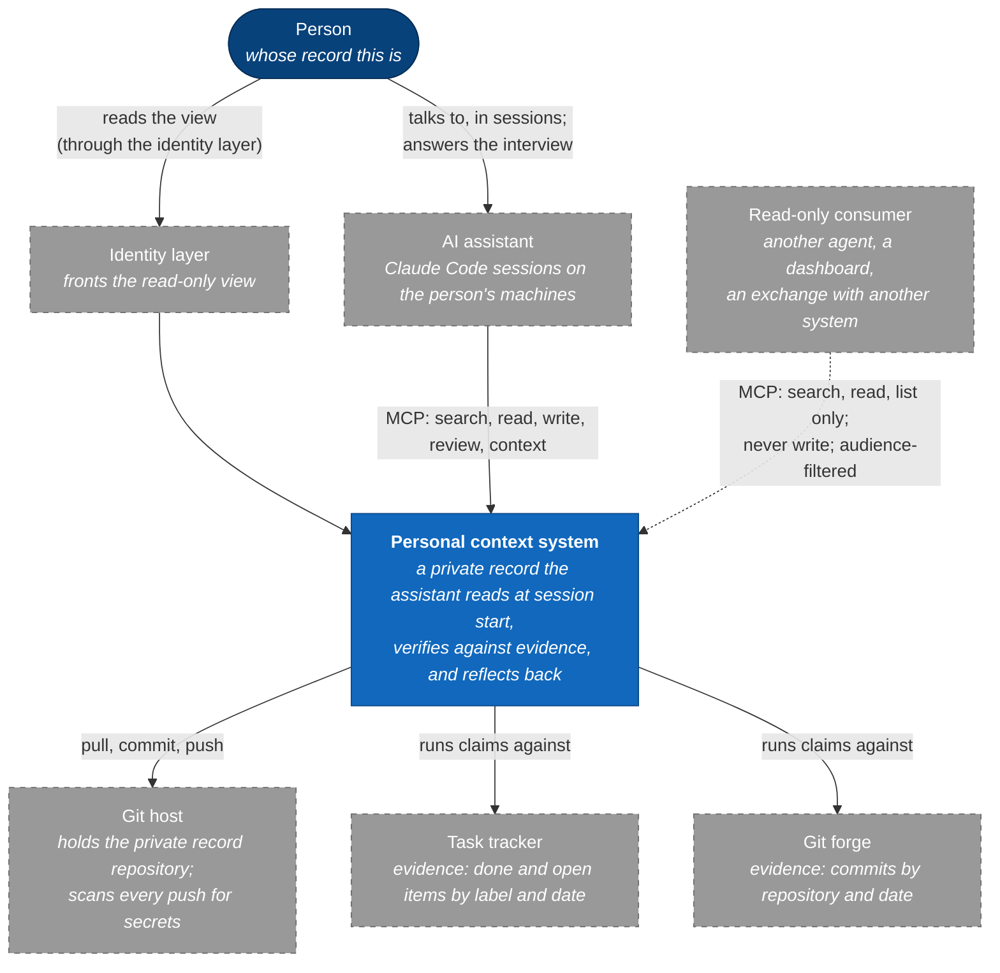
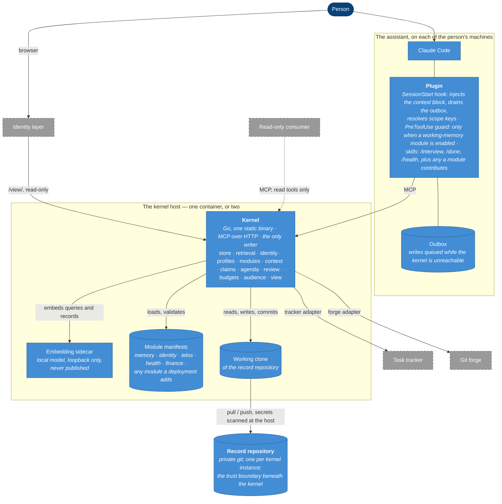
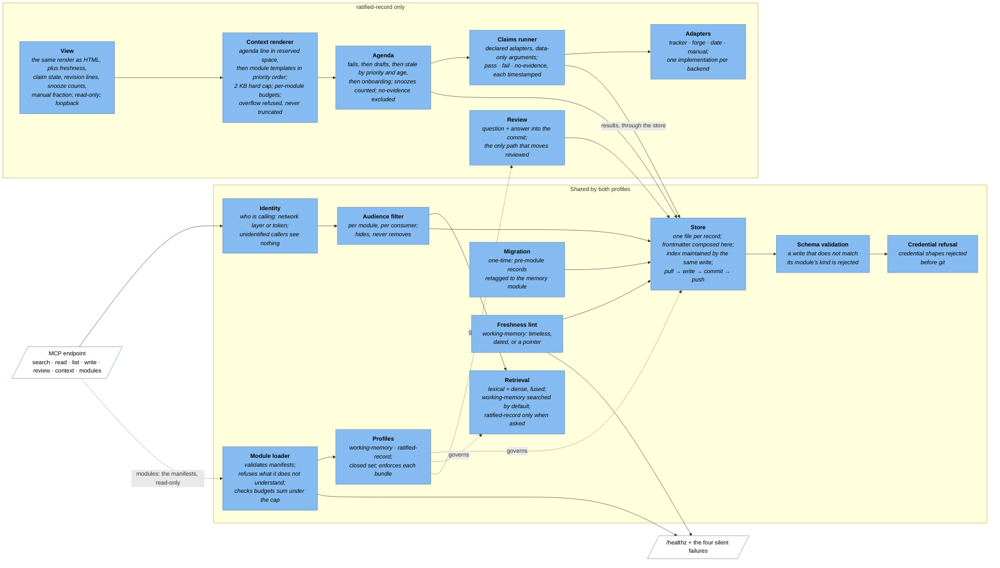
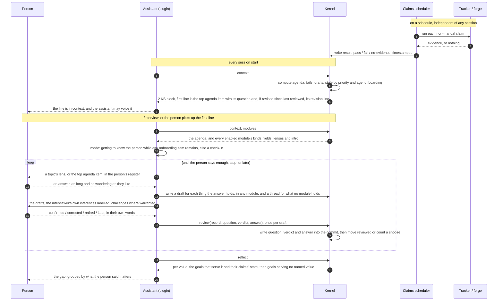

# The personal context system — C4 diagrams

Companion to [`personal-context-system-v1.md`](personal-context-system-v1.md) at v1.6. These
diagrams say the same thing as the spec at four altitudes; where they disagree, the spec wins.
Names are the spec's descriptive ones. M1 is built; the conversational interview of the fourth
diagram arrives with M2.

The diagrams follow the [C4 model](https://c4model.com/): a context diagram for who uses the
system and what it talks to; a container diagram for the separately deployable pieces; a
component diagram for the inside of the kernel; and a dynamic diagram for the one flow that
matters most, the interview. They are Mermaid flowcharts styled by C4 level rather than
Mermaid's own C4 syntax, so they render anywhere Mermaid does.

Legend: a rounded box is a person; a rectangle is a system, container or component at the
diagram's level; a dashed border is something outside the system; a cylinder is a store.

## Level 1 — system context

Who uses it, and what it depends on. The system is one box here; everything else is outside
it and configured per deployment.

Two things this level fixes. The person never touches the system directly except through the
assistant or the view. And the read-only consumer's arrow is dashed and one-way: it is
identified like any caller, sees only modules whose audience is `any`, and has no write path
(spec §11).

## Level 2 — containers

The separately deployable pieces. One kernel instance serves one repository; a deployment
enables some set of modules (spec §4, §5).

What the picture is careful about:

- **The plugin is thin.** Two hooks, one of them conditional, and skills. Nothing in the
  assistant's global configuration changes except the plugin's registration (spec §3.2).
- **The kernel is the only writer** to the working clone, and the clone is the only path to the
  repository. A sibling process that runs claims writes its results through the kernel, not to
  the clone (spec §8.1).
- **The embedding sidecar publishes nothing.** It exists because the kernel is a static binary
  and the model call should cross a visible boundary.
- **The identity layer is the deployment's**, not the system's. The view has no authentication of
  its own and binds to loopback (spec §10).
- **Two kernel instances, two repositories** is how a second trust domain — a memory shared with
  other people — would sit beside this one, with the plugin registering both. It is not drawn
  because it is not designed (spec §15).

## Level 3 — components of the kernel

What is inside the kernel box, and which profile each component serves. Everything to the left
of the profiles line is shared by both; everything to the right belongs to `ratified-record`
modules, with the two exceptions noted.

Reading order for someone new: a request enters at the MCP endpoint, is identified, is
audience-filtered, and only then reaches retrieval or the store. A write passes schema validation
and credential refusal before it becomes a commit. The profile of the record's module decides
whether that write may be a plain `write` or must be a `review`. The claims runner never reads
the request path at all; it runs on a schedule and its results re-enter through the store like
any other write.

## Level 4 — the interview, as a dynamic diagram

The one flow that makes the system more than a notebook. The kernel makes two decisions — what is
due, and what counts as reviewed — and the assistant holds the conversation around them (spec §9).

Four things the sequence makes visible that prose can hide. The scheduler and the session never
touch each other; they meet only in the store. The kernel decides what is due, and the assistant
decides how to ask about it. Drafts reach the store before anything is confirmed, so a stop in the
middle loses nothing and the next session's agenda opens on them. And `reviewed` moves at exactly
one step, on a call that carries the question, the verdict and the person's words, so the record's
history can be read as a list of things the person was asked and said.

## What is deliberately not drawn

- **A deployment diagram.** C4's fourth standard diagram places containers on infrastructure.
  That is one deployment's business, and the spec is careful to have none in it; the operator's
  companion note is where a deployment draws its own.
- **The module internals.** A module is a manifest, templates, optional skills and optional
  adapters; there is no runtime inside it to diagram. Its contract is spec §6.
- **The second kernel instance** for a shared memory across people (spec §15). When it is
  designed, it is a second copy of the container diagram with a different repository and the
  plugin's MCP registration pointing at both.
