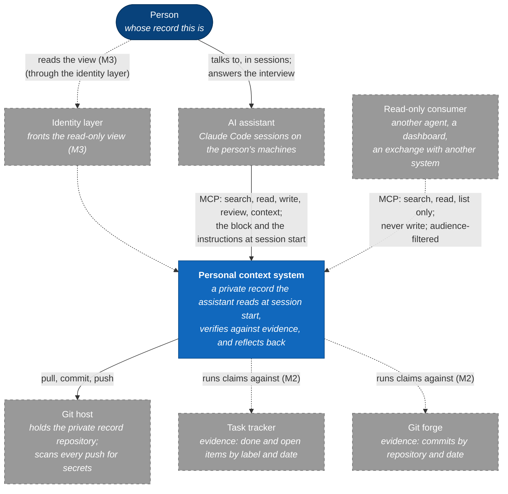
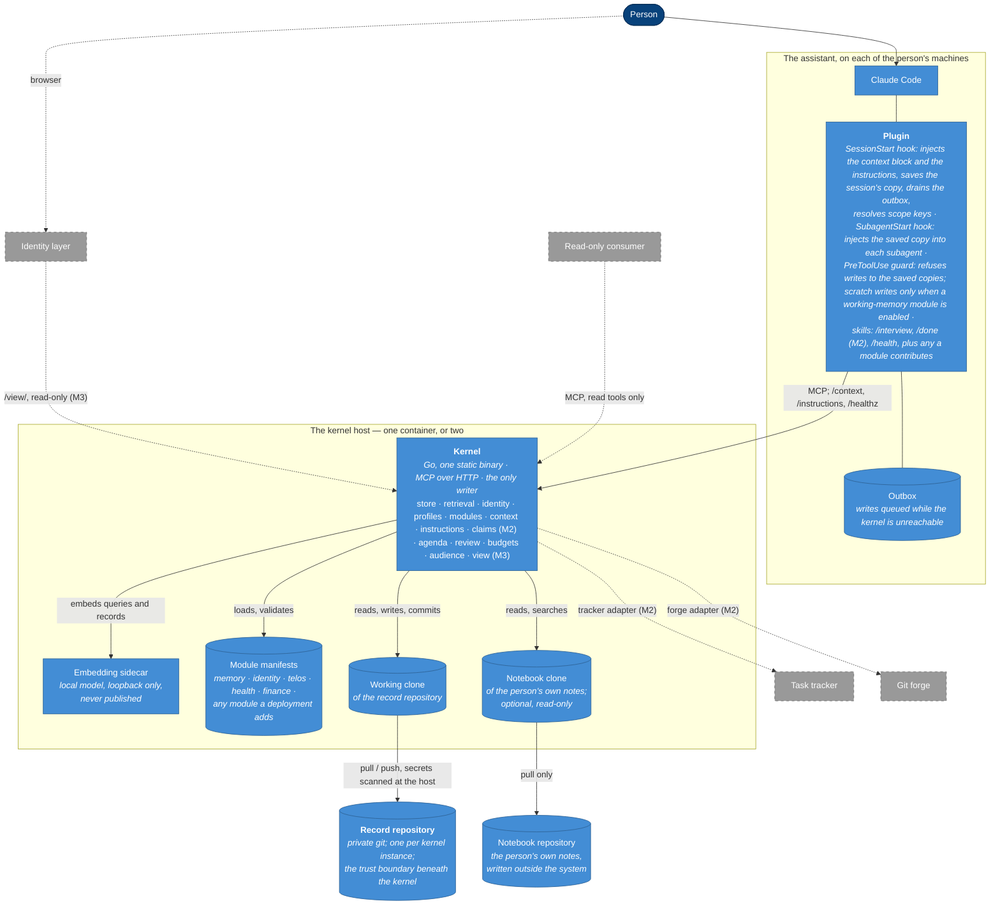
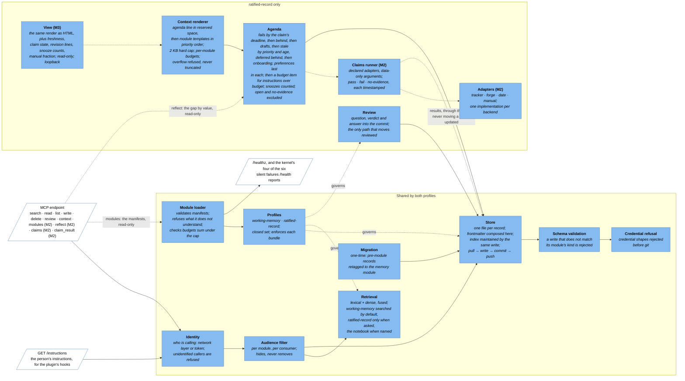
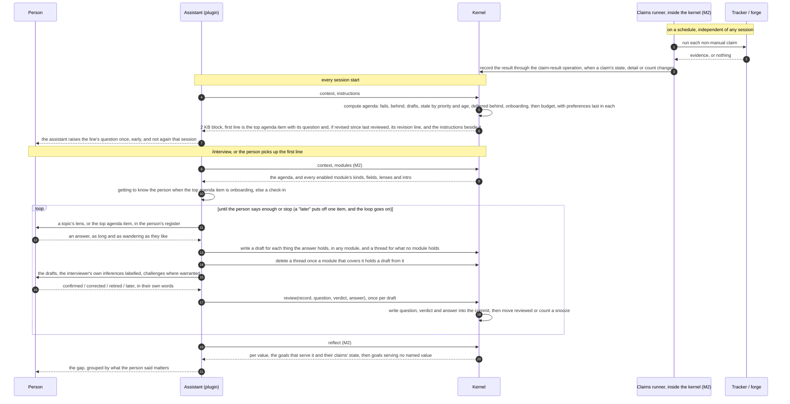

# The personal context system — C4 diagrams

These diagrams accompany [`personal-context-system-v1.md`](personal-context-system-v1.md) at
v1.10. They describe the same system as the specification at four levels of detail, and where they
disagree, the specification is correct. Components carry the specification's descriptive names.

The diagrams show the whole design, not only what is built. An element tagged with a milestone,
such as "(M2)", arrives in that milestone, and its arrows are dashed; §14 of the specification says
which milestones are delivered. A tag stays true after delivery, so the diagrams need no update
when a milestone lands. The conversational interview of the fourth diagram is also M2.

The diagrams follow the [C4 model](https://c4model.com/): a context diagram for who uses the
system and what it talks to; a container diagram for the separately deployable pieces; a
component diagram for the inside of the kernel; and a dynamic diagram for the one flow that
matters most, the interview. They are Mermaid flowcharts styled by C4 level rather than
Mermaid's own C4 syntax, so they render anywhere Mermaid does.

In every diagram, a rounded box is a person, a rectangle is a system, container or component at
that diagram's level, a dashed border marks something outside the system, and a cylinder holds
data.

## Level 1 — system context

Who uses it, and what it depends on. The system is one box here; everything else is outside
it and configured per deployment.

This level fixes two things. The person reaches the system only through the assistant or the
view, never directly. And the read-only consumer's arrow is dashed and one-way, because a consumer
is identified like any caller, sees only modules whose audience is `any`, and has no write path; a
write influenced by an untrusted reader would be injection into the person's next session
(spec §11).

## Level 2 — containers

These are the separately deployable pieces. One kernel instance serves one record repository,
and may also read the person's own notes as the notebook. A deployment chooses which modules to
enable (spec §4, §5).

The diagram is deliberate about six things:

- **The plugin is thin.** It has three hooks and a few skills. `SessionStart` and `SubagentStart`
  always run; the `PreToolUse` guard always refuses writes to the saved instructions, and refuses
  writes to scratch only when a working-memory module is enabled. Installing it changes nothing in
  the assistant's global configuration except the plugin's own registration (spec §3.2).
- **The kernel is the only writer** to the working clone, and the clone is the only path to the
  repository. The claims runner is part of the kernel, so a claim result reaches the clone
  through the kernel's claim-result operation like any other change (spec §8.1).
- **The notebook is read-only.** The kernel pulls the person's own notes and never commits to
  them, so the one-writer rule still holds. The notes have no modules and so no audience of their
  own, which is why a consumer is refused them outright (spec §5, §11).
- **The embedding sidecar publishes nothing.** It is a separate container because the kernel is
  a static binary, and because the call to a model should cross a boundary that can be seen.
- **The identity layer belongs to the deployment**, not the system. The view has no
  authentication of its own and binds to loopback, so the deployment's identity layer is the only
  way to reach it (spec §10).
- **Two kernel instances with two repositories** is how a second trust domain, such as a memory
  shared with other people, would sit beside this one, with the plugin registering both. It is not
  drawn because it is not yet designed (spec §15).

## Level 3 — components of the kernel

This level shows what is inside the kernel, and which profile each component serves. The
components in the first group serve both profiles; those in the second serve only
`ratified-record` modules.

For someone reading the diagram for the first time: a request enters at the MCP endpoint, is
identified, is filtered by audience, and only then reaches retrieval or the store. A write passes
schema validation and credential refusal before it becomes a commit. The profile of the record's
module decides what the write means: in a `working-memory` module it is complete, and in a
`ratified-record` module it leaves a draft that only a `review` can confirm. The claims runner
(M2) never sees a request; it runs on the deployment's interval, and its results enter the store
through the kernel's claim-result operation, so the kernel remains the only writer and a result
never makes a goal look revised. The working-memory freshness lint is not drawn, because it runs
in the plugin's `/health` skill rather than in the kernel (spec §4.2).

## Level 4 — the interview, as a dynamic diagram

The interview is the flow that makes the system more than a place to keep notes. The kernel makes
two decisions, what is due and what counts as reviewed, and the assistant holds the conversation
around them (spec §9). Keeping those two decisions in the kernel means the conversation can be as
loose as the person likes without anyone being able to mark a record confirmed that the person did
not confirm.

The sequence makes four things visible that prose can hide. The scheduler and the session never
touch each other; they meet only in the store. The kernel decides what is due, and the assistant
decides how to ask about it. Drafts reach the store before anything is confirmed, so a stop in the
middle loses nothing and the next session's agenda opens on them. And `reviewed` moves at exactly
one step, on a call that carries the question, the verdict and the person's words, so the record's
history can be read as a list of things the person was asked and said.

## What is deliberately not drawn

- **A deployment diagram.** C4's fourth standard diagram places containers on infrastructure.
  That belongs to each deployment, and the specification deliberately describes none, so that it
  holds no one person's setup (spec §12). A deployment draws its own in the operator's notes.
- **The inside of a module.** A module is a manifest, templates and optional skills. It declares
  the adapters it uses but carries none, because an adapter is kernel code; so a module has no
  running code of its own to diagram. Its contract is spec §6.
- **The second kernel instance** for a shared memory across people (spec §15). When it is
  designed, it is a second copy of the container diagram with a different repository and the
  plugin's MCP registration pointing at both.
